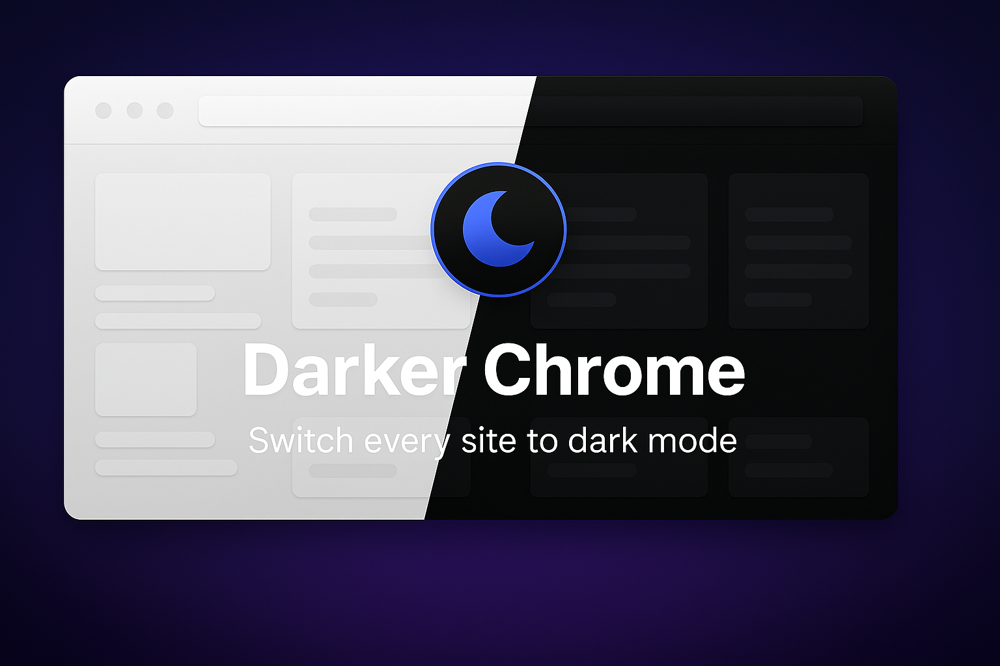
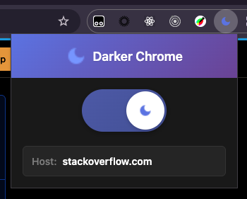
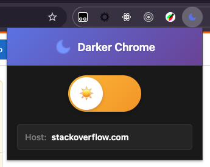

#  Darker Chrome



A chrome extension to transform any website into dark mode with a single click!

|  |  |
| --- | --- |

## Features

- **Universal Dark Mode**: Applies dark mode to any website using CSS inversion
- **Per-Site Control**: Enable/disable dark mode individually for each website
- **Persistent Settings**: Remembers your preferences for each site
- **Modern UI**: Clean, dark-themed popup interface
- **TypeScript**: Built with TypeScript for better code quality

## Installation

### Development Installation

1. **Clone and Install**:
   ```bash
   git clone <your-repo-url>
   cd darker-chrome
   npm install
   ```

2. **Load in Chrome**:
   - Open Chrome and go to `chrome://extensions/`
   - Enable "Developer mode" (toggle in top right)
   - Click "Load unpacked"
   - Select the `darker-chrome` folder

3. **Pin the Extension**:
   - Click the puzzle piece icon in Chrome toolbar
   - Pin "Darker Chrome" for easy access

## Usage

### Toggle Dark Mode

1. **Click the Extension Icon**:  in your Chrome toolbar
2. **View Current Site**: The popup shows the current website hostname
3. **Toggle Dark Mode**: Click the button to enable/disable dark mode for the current site
4. **Status Indicator**: See if dark mode is ON or OFF for the current site

### Per-Site Settings

- Each website remembers its dark mode setting independently
- Settings are synced across your Chrome browsers (if signed in)
- No need to toggle repeatedly - your preferences are saved

## How It Works

The extension uses CSS filter inversion to create a dark mode effect:

```css
html, img, video, iframe {
  filter: invert(1);
}
```

This inverts all colors on the page, effectively creating a dark theme. The extension:

1. **Content Script**: Injects the dark mode CSS when enabled
2. **Background Script**: Manages extension lifecycle
3. **Popup Interface**: Provides user controls and site-specific settings
4. **Chrome Storage**: Persists settings per hostname

## File Structure

```
darker-chrome/
├── manifest.json          # Extension configuration
├── popup.html             # Popup interface
├── popup.css              # Popup styles
├── src/
│   ├── content.ts         # Content script (injected into pages)
│   ├── background.ts      # Background service worker
│   └── popup.ts           # Popup script
├── scripts/
│   └── pack.ts            # Packing script
├── icons/                 # Extension icons
├── package.json           # Dependencies and scripts
└── tsconfig.json          # TypeScript configuration
```

## Development

### Build Commands

```bash
# Install dependencies
npm install

# Pack for distribution (creates zip)
npm run pack
```

### TypeScript Configuration

The project uses TypeScript with Chrome extension types for better development experience and type safety.

### Distribution

To create a distributable version of the extension:

1. **Pack**:
   ```bash
   npm run pack
   ```

2. **Output Files**:
   - `darker-chrome-v0.0.1.zip` - Ready for Chrome Web Store or sharing

3. **What's Included**:
   - All necessary extension files
   - TypeScript source files
   - Icons and assets

4. **Installation Options**:
   - **Development**: Load the root folder in Chrome
   - **Distribution**: Share the `.zip` file

## Browser Compatibility

- **Chrome**: Manifest V3 (Chrome 88+)
- **Edge**: Chromium-based Edge
- **Other Chromium browsers**: Should work with Manifest V3 support

## Limitations

- **Filter-based Approach**: Uses CSS inversion which may not work perfectly on all sites
- **Images/Videos**: All media content is also inverted (this is by design)
- **Complex Sites**: Some sites with complex CSS may not look perfect in dark mode

## Future Enhancements

- [ ] Whitelist/blacklist for specific domains
- [ ] Custom dark mode CSS rules
- [ ] Smart detection for sites that already have dark mode
- [ ] Exclude certain elements from inversion
- [ ] Keyboard shortcuts

## Contributing

1. Fork the repository
2. Create a feature branch
3. Make your changes
4. Build and test the extension
5. Submit a pull request

## License

MIT License - feel free to use and modify as needed.

---

**Enjoy browsing in the dark! ** 